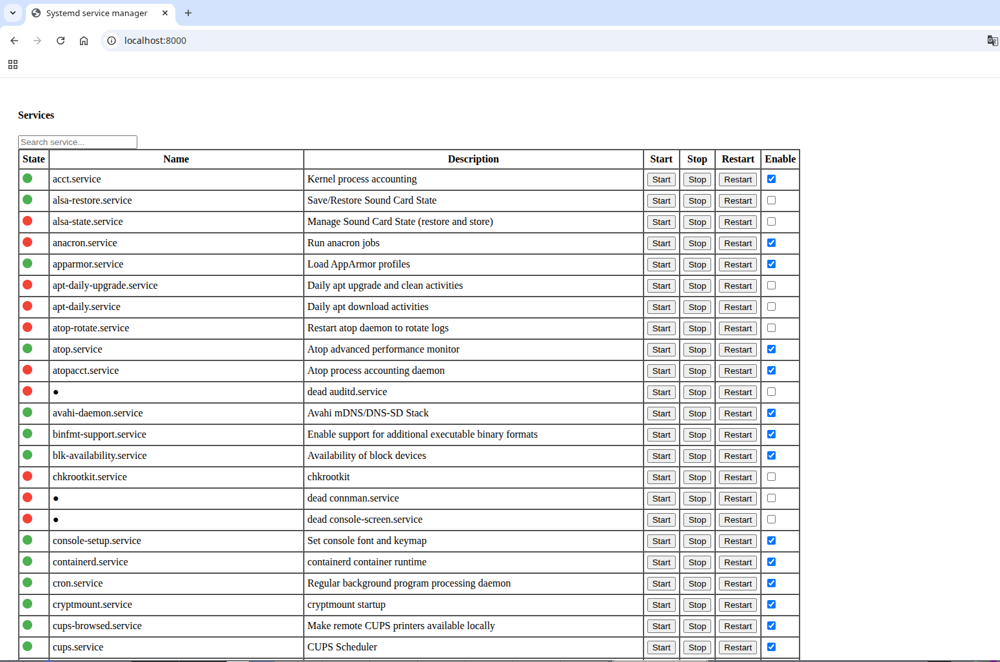

# SystemdServiceManager
This web was writter with Django Framework allows you to manage your Systemd services from your browser

Features:
- Start, stop or restart services
- Enable or disable services 

Based on systemctl it uses this commads for interation with systemd
``` shell
systemctl start/stop/restart service
systemctl enable/disable service
```

If you want in sudoers file you can a user for dont having to enter password like this and allow him to use it otherwise 
you will be prompted for root password every action.

``` shell
user ALL=NOPASSWD: /bin/systemctl 
```
I include a systemdservicemanager.service file for Systemd Service 

Run as any Django project:

``` shell
python manage runserver
```


SystemdServiceManager version 1.0.1 by pmartinezr@proton.me

This software is License GPL v3


